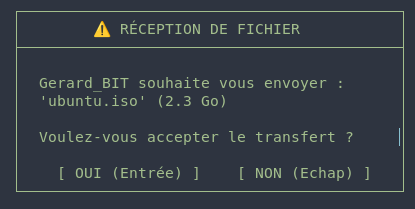

# Software Requirement Specifications (SRS)
## Introduction
>Toolé est un programme TUI permettant de transfere des fichiers de maniere securisé entre deux ordinateurs en utilisant le reseau wifi en mode P2P (Peer to peer),elle se veut le plus simple d'utilisation possible pour l'utilisation par tous.[En savoir plus](brouillon.md)

## Description general du systeme

### Contraintes de conception:
- Le language C
- Les OS linux et Windows
- Version minimale avec un TUI fonctionnel
- chifrement des données pendant le transfert pour eviter le Man-in-the-Middle

## Exigences fonctionnelles

### Appairage à proximité [F-001](PRD.md#linventaire-des-fonctionnalités)

- E-001: Le system doit envoyer chaque 1000ms un beacon contenant: l'IP,le port pour le TCP,le message Auto
- E-002: Le message auto doit etre optionnel et c'est l'utilisateur qui l'active
- E-003: Le systeme doit ecouté permennament sur un port specifique
- E-004: Si un appareil a deja un client en tant que serveur TCP, tout autre appareil qui vient à lui doit automatiquement etre client

### Transfere de fichiers sécurisé [F-002](PRD.md#linventaire-des-fonctionnalités)

- E-005: Toute demaande de connexion doit etre d'abord accepté qu'elle soit automatique ou pas.
- E-006: La connexion par TCP doit se fait par autodeterminisme pour savoir qui sera serveur et qui sera client (serveur:IP superieur,client:IP inferieur)
- E-007: Le systeme doit utiliser le Zero-copy pour le transfere de fichier  

### Une interface TUI (Text-based User Interface) [F-003](PRD.md#linventaire-des-fonctionnalités)

- E-008: Le Tui doit presenter une barre de progresion pendant le transfere de fichier

## Exigences non fonctionnelles
 - La decouverte UDP doit etre rapide 
 - Le transfere de fichier doit etre tres rapide

## Interface externe

>
>
>
>

---
>[Achitecture et schemas](diagram.md)
